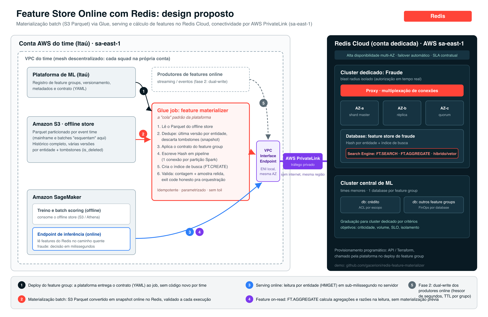

# redis-feature-materializer

Portable, plug-and-play reference for running an **online feature store on Redis**, hydrated from an S3 offline store (SageMaker-style Parquet) through a standard **AWS Glue job**. Everything here runs in two modes with the same code:

- **Laptop mode**: MinIO plays S3, Redis 8 in Docker, Spark in a throwaway container. No AWS account, no installs.
- **AWS mode**: the same job deployed as a real Glue job in your account, writing to Redis Cloud.

That symmetry is the point: what you demo locally is byte-for-byte what runs in production.



## Quickstart (laptop, ~3 minutes)

```bash
./run_demo.sh          # MinIO + Redis up, offline store generated, simple hydration, validated
./run_glue_local.sh    # the actual Glue job running on containerized Spark against MinIO
docker compose down    # teardown
```

Expected outcome: 2,078 raw records collapse into 970 live entities (latest version per entity, 30 tombstones dropped), key count and sampled content validated, search index created, exit code 0.

## AWS mode (real Glue job)

```bash
./deploy_glue_aws.sh setup      # S3 bucket + demo offline store + IAM role + Glue job
```

```bash
REDIS_HOST=... REDIS_PORT=... REDIS_PASSWORD=... ./deploy_glue_aws.sh run
```

```bash
./deploy_glue_aws.sh teardown   # removes job, role and bucket
```

`run` starts the Glue job (2x G.1X, ~2 minutes, about USD 0.05), polls to completion and prints proof straight from Redis: key count, one full entity, and an `FT.AGGREGATE` computing features at read time. You can also bake the parameters as Glue DefaultArguments and trigger runs from the console button alone.

## What the materializer job does

`glue_feature_materializer.py` is driven by a **feature contract** (JSON mirroring the feature platform's metadata): entity column, event time, features and index types, key prefix, TTL. The job:

1. Reads the Parquet offline store (partition discovery included).
2. Resolves the latest version per entity (`ROW_NUMBER` over event time, write time as tie-breaker) and drops `is_deleted` tombstones. Snapshot semantics, never file copy.
3. Writes Redis hashes from the executors: one connection per Spark partition, pipelined in batches of 500. Connection count is explicit and predictable.
4. Creates the RediSearch index from the contract (`FT.CREATE ... ON HASH`).
5. Validates itself: key count plus a random sample read back field by field. Any mismatch exits non-zero, so orchestration sees failures.

Idempotent by design: re-running overwrites the same keys.

## Why Redis for the online store

- O(1) reads per entity (`HMGET`/`HGETALL`), sub-millisecond server-side.
- Features computed **at read time** with the search engine, no prior materialization: `FT.AGGREGATE` with `GROUPBY`/`APPLY` over the indexed hashes.
- The Redis Enterprise proxy multiplexes client connections, so Spark executors and serving fleets never exhaust the database.

## Repository layout

| Path | Purpose |
|------|---------|
| `glue_feature_materializer.py` | The reference Glue/Spark job (runs unchanged on Glue and spark-submit) |
| `make_offline_store.py` | Generates a realistic offline store: Glue-format partitions, metadata columns, multi-version history, tombstones |
| `hydrate.py` | Standalone Python hydrator (no Spark) with the same snapshot semantics, for small loads |
| `run_demo.sh` / `run_glue_local.sh` | Laptop mode |
| `deploy_glue_aws.sh` | AWS mode: setup, run, teardown |
| `try_riotx_s3.sh` | Alternative loader: RIOT-X reading Parquet straight from S3 |
| `docs/roteiro_demo.md` | Demo talk track (PT-BR, customer-facing) |
| `docs/runbook_aws_producao.md` | Production runbook with Athena UNLOAD + RIOT-X path (PT-BR) |

## License

MIT
